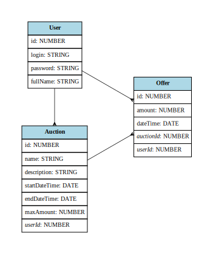

# AuctionApp - Client Side Rendering

App allows to manage auctions and take part in it. This is improved version using React and having additional abilities than SSR version.

## Tech stack

Express JS, React.js, Node.js, MSSQL, Sequelize, Jest, Material UI, Docker Compose

### Running app

The only thing in order to start app is to use docker-compose.yml file.

### Tests

npm run test

# Dokumentacja projektu

## Identyfikacja zagadnienia biznesowego

Aplikacja służy do zarządzania przetargami i brania w nich udziału. Jest przeznaczona głównie dla firm i instytucji, jednak osoby fizyczne też mogą z niej korzystać. Aplikację tą należy traktować jako szkielet dla prawdziwej aplikacji - mimo wielu funkcji wciąż nie zaspokoiłaby potrzeb użytkowników w realnym świecie ze względu na potrzebę zastosowania wielu mechanizmów.

## Wymagania systemowe i funkcjonalne

Aplikacja została stworzona w modelu REST API (serwer) oraz Client Side Rendering (frontend).

Wymagania techniczne: dowolny system operacyjny obsługujący Node.js oraz Microsoft SQL z dostępem do Internetu. Aplikacja jest lekka, dzięki czemu nie potrzeba mocnej maszyny do jej uruchomienia.

Wymagania funkcjonalne:

-   przeglądanie szczegółów przetargów,
-   wyświetlanie aktywnych i zakończonych przetargów,
-   dodawanie nowych przetargów,
-   branie udziału w przetargu i edycja oferty,
-   logowanie i rejestracja,
-   podgląd własnych przetargów i aukcji.

## Analiza zagadnienia i jego modelowanie

Metody obiektowe:

-   Diagram klas:

    -   Klasa "Auction" reprezentuje przetarg i zawiera pola danych takie jak: id (NUMBER), name (STRING), description (STRING), startDateTime (DATE), endDateTime (DATE), maxAmount (NUMBER) oraz userId (NUMBER), który wskazuje na właściciela przetargu.
    -   Klasa "Offer" reprezentuje ofertę i zawiera pola danych takie jak: id (NUMBER), amount (NUMBER), dateTime (DATE), auctionId (NUMBER) oraz userId (NUMBER), które wskazują na przetarg i użytkownika złożającego ofertę.
    -   Klasa "User" reprezentuje użytkownika i zawiera pola danych takie jak: id (NUMBER), login (STRING), password (STRING) oraz fullName (STRING).

-   Diagram interakcji obiektów:
    -   W aplikacji użytkownik może stworzyć przetarg (Auction) i składający ofertę (Offer).
    -   Przetarg może być powiązany z jednym użytkownikiem (User) jako jego właścicielem.
    -   Oferta musi być przypisana do konkretnego przetargu i użytkownika.

Metody strukturalne:

-   Diagram związków encji:
    -   Encja "Auction" posiada relację z encją "User" (właściciel przetargu).
    -   Encja "Offer" posiada relacje z encjami "Auction" (przetarg, do którego jest składana oferta) i "User" (użytkownik składający ofertę).

Definicje:

-   Encje:

    -   "Auction": Reprezentuje przetarg. Posiada atrybuty: id, name, description, startDateTime, endDateTime, maxAmount, userId.
    -   "Offer": Reprezentuje ofertę. Posiada atrybuty: id, amount, dateTime, auctionId, userId.
    -   "User": Reprezentuje użytkownika. Posiada atrybuty: id, login, password, fullName.

-   Atrybuty:

    -   Id: Unikalny identyfikator przetargu, oferty lub użytkownika.
    -   Name: Nazwa przetargu.
    -   Description: Opis przetargu.
    -   StartDateTime: Data i godzina rozpoczęcia przetargu.
    -   EndDateTime: Data i godzina zakończenia przetargu.
    -   MaxAmount: Maksymalna kwota, która może zostać zaoferowana w przetargu.
    -   UserId: Identyfikator użytkownika, który jest właścicielem przetargu lub składający ofertę.
    -   Amount: Kwota oferty.
    -   DateTime: Data i godzina złożenia oferty.

-   Procesy:

    -   Tworzenie przetargu: Użytkownik tworzy nowy przetarg, podając jego nazwę, opis, datę rozpoczęcia, datę zakończenia i maksymalną kwotę.
    -   Składanie oferty: Użytkownik składa ofertę na wybrany przetarg, podając kwotę oferty.
    -   Logowanie: Użytkownik loguje się do aplikacji, podając swój login i hasło.

-   Przepływy danych:

    -   Informacje o przetargach, ofertach i użytkownikach przepływają pomiędzy warstwą prezentacji (klientem) a warstwą logiki biznesowej (serwerem) w formacie JSON.

-   Dane złożone i elementarne:
    -   Dane złożone: Przykładem danych złożonych może być obiekt przetargu (Auction) lub oferta (Offer), które zawierają wiele pól danych.
    -   Dane elementarne: Przykładem danych elementarnych może być pojedynczy atrybut, tak jak id, name, amount itp.

## Implementacja

1. Rejestracja i logowanie użytkowników:

    - W przypadku rejestracji, pobieranie danych z formularza, sprawdzenie unikalności loginu, zahaszowanie hasła z użyciem klucza w celu zabezpieczenia go w bazie danych i zapisanie użytkownika do bazy danych.
    - W przypadku logowania, sprawdzenie czy podane dane logowania są poprawne, a następnie generacja tokenu uwierzytelniającego (JWT) i zwrócenie go jako odpowiedź do klienta.
    - Przechowywanie tokenu uwierzytelniającego po stronie klienta w pamięci lokalnej w celu autoryzacji i dostępu do chronionych zasobów.

2. Przeglądanie przetargów:

    - W komponencie Reacta wykonanie żądania HTTP do odpowiedniej trasy API i odebranie danych przetargów.
    - Wykorzystanie komponentów Reacta do wyświetlenia listy przetargów na stronie, uwzględniając sortowanie, filtrowanie i paginację.
    - Wyświetlanie szczegółów przetargu i składanie ofert po kliknięciu elementu na liście.

3. Składanie ofert:

    - W komponencie Reacta znajduje się formularz składania ofert, dane są pobierane z formularza i następuje żądanie HTTP do odpowiedniej trasy API.
    - W obsłudze żądania w Express.js, zapisanie ofertę w bazie danych jeśli użytkownik jeszcze nie brał udziału w przetargu, a jeśli brał, zastąpienie starej wartości nową i zwrócenie odpowiedniej odpowiedzi do klienta.

4. Zarządzanie przetargami:

    - Dodatkowe trasy API w Express.js, które umożliwią tworzenie, edycję i usuwanie przetargów dla właściciela przetargu.
    - W komponencie Reacta interfejs do zarządzania przetargami w celu dodawania, edycji i usuwania przetargów.
    - W obsłudze żądań w Express.js wykonanie odpowiednich operacji na bazie danych w zależności od żądania.

5. Własne przetargi i oferty:

    - API udostępnia ścieżki do pobrania związanych z użytkownikiem ofert oraz przetargów.
    - W komponencie Reacta wyświetlenie odpowiednich list i umożliwienie podglądu oraz zarządzania przetargami oraz ofertami.

Ważne narzędzia i biblioteki:

-   Express.js: obsługa żądań HTTP, definiowanie tras i przetwarzanie danych,
-   React.js: do budowania interfejsu użytkownika. Używa komponentów funkcyjnych, zarządza stanem aplikacji za pomocą hooków, wykonuje żądania HTTP itp.,
-   Node.js: Środowisko uruchomieniowe do serwera oraz budowania aplikacji klienckiej,
-   Microsoft SQL: system bazy danych,
-   Sequelize: narzędzie ORM (Object–Relational Mapping) ułatwiające integrację backendu z bazą danych,
-   Jest: narzędzie do przeprowadzania testów,
-   Material UI: zbiór kontrolek w stylu Material dla Reacta,
-   JWT (JSON Web Tokens): do uwierzytelniania użytkowników i zabezpieczania endpointów,
-   Docker Compose - do ułatwienia uruchomienia aplikacji poprzez przygotowanie środowiska.

## Podsumowanie

Stworzona aplikacja jest świetnym szkieletem dla aplikacji zbudowanej w celu użycia w realnym świecie. Wymagała by jednak wielu usprawnień i pokrycia wiekszej ilości kodu testami. Największą trudnością było tu korzystanie z języka JavaScript na backendzie - moim zdaniem aplikacja backendowa powinna być stworzona w języku silnie typowanym, gdyż ułatwia to korzystanie z pól obiektów, poprawia czytelność i zmniejsza ilość potencjalnych błędów. Perspektywy rozwoju są z całą pewnością duże - można dodać np. przywracanie hasła, obserwowanie cudzych aukcji, powiadomienia o aukcjach (w aplikacji oraz na maila), wielojęzyczność. W celu uwzględnienia wszystkich potrzeb potencjalnych użytkowników należałoby zebrać opinie od takich osób.
